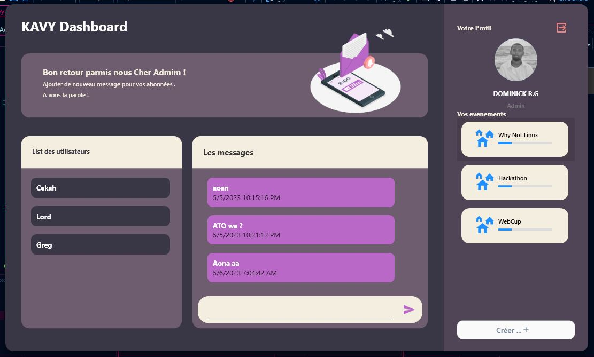
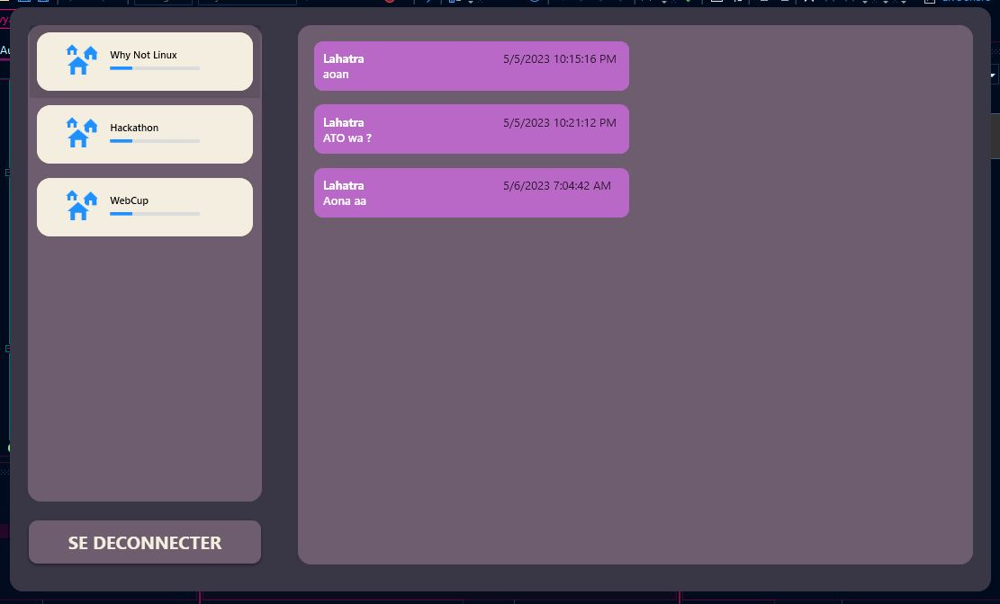
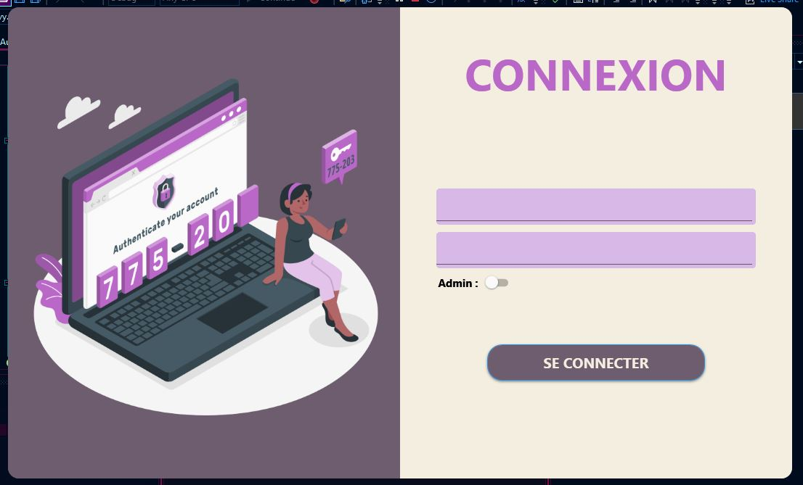

<h1 align="center">Kavy</h1>

  

  

  

 

The following tools were used in this project:

- [WPF](https://learn.microsoft.com/fr-fr/visualstudio/get-started/csharp/tutorial-wpf?view=vs-2022)
- [MySql](https://www.mysql.com/fr/)
- [C#](https://learn.microsoft.com/fr-fr/dotnet/csharp/)

## :white_check_mark: Desciption ##

ESTI , student project of an admin dasboard created with WPF C#.

Made by <a href="https://github.com/c3k4ah" target="_blank">DOMINICK</a> and <a href="https://github.com/lahatra3" target="_blank">LAHATRA</a>

&#xa0;
 

  
   
  
   
  

<a href="#top">Back to top</a>
